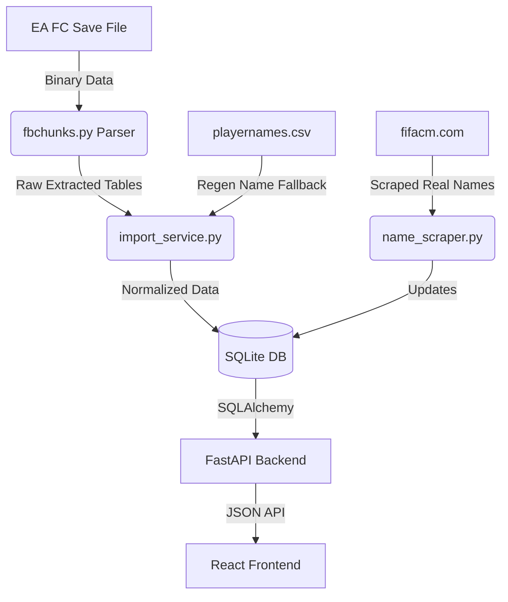

# FC-Universe Architecture Overview

Welcome to the FC-Universe project! This document outlines the core architecture, data pipelines, and individual moving parts that make this application work. It serves as a comprehensive onboarding guide for new contributors to understand how the EA FC 26 career mode save data is ingested, processed, and displayed.

---

## 1. High-Level Architecture

The application is split into a **React Frontend** and a **FastAPI Backend**, backed by a **SQLite Database**.
The core value of the application comes from its custom built binary parser, which directly reads local EA FC 26 save files (Career Mode) and normalizes the data into a web-friendly format.

---

## 2. The Backend (`/backend`)

The backend is built with **Python 3**, **FastAPI**, and **SQLAlchemy**. It serves two primary roles: parsing/importing the save files and serving the data to the frontend via a REST API.

### Core Data Pipeline (The Parsers)
The EA Sports FC save file uses a proprietary `FBCHUNKS` format containing compressed, bit-packed tables.
- **`src/fc_universe/parser/fbchunks.py`**: A custom Python port of an external save parser. It reads the binary save file, identifies the database blocks, and unpacks the bit-shifted rows into Python dictionaries.
- **`src/fc_universe/services/import_service.py`**: The mapping engine. It takes the raw dictionaries outputted by `fbchunks.py` and maps them into our normalized SQLAlchemy models (`Player`, `Club`, `Career`). It handles tricky logic like parsing the `CZUM` table for player stats, the `lyxL` table for clubs, and the `bneD` table for dynamic youth player names.

### Database Schema
We use **SQLite** (`fc_universe.db`) with **SQLAlchemy** ORM.
- **`src/fc_universe/models/`**: Contains the schemas for `Career`, `Club`, and `Player`. The `Player` table alone tracks over 145 different in-game stats directly scraped from the game engine.

### API Layer
- **`src/fc_universe/api/`**: Contains the FastAPI routers. 
  - `players.py`: Exposes endpoints to list and search players (e.g. `?search=Mbappe`).
  - `images.py`: A very important proxy endpoint. The frontend cannot directly load images from EA's CDNs due to CORS restrictions. The backend provides proxy routes (`/api/images/player/{id}` and `/api/images/club/{id}`) that fetch the image from EA servers and stream it to the client.

### Essential Utility Scripts
There are several standalone Python scripts in `backend/src/` used for maintenance and data extraction:
- **`import_save.py`**: Drops the existing database, runs the `FbChunksParser` on a hardcoded save file, and populates the database using the `ImportService`.
- **`name_scraper.py`**: A critical script for real-world players. Because the EA save file only stores Name IDs (not the actual strings), this script iterates over all real players (`game_id < 270000`) and scrapes their real names from `fifacm.com` to patch the database.
- **`map_research.py` & `dump_fields.py`**: Debugging scripts used to reverse-engineer the hex column headers in the EA save file (e.g. figuring out that `UERs` = Overall Rating).

---

## 3. Data Sources & External Repos

### The Save File
The primary source of truth is the user's local Career Mode save file, typically located at:
`C:\Users\[User]\AppData\Local\EA SPORTS FC 26\settings\CmMgrC...`

### The Name Resolution Problem
EA does not store player names directly in the save file tables; it stores `firstnameid`, `lastnameid`, and `commonnameid`. To resolve these to readable text, we use two external sources:
1. **`parser_repo/fc-cm-web-parser-main/public/playernames.csv`**: An external CSV file mapping IDs to names. We use this primarily as a fallback dictionary for dynamically generated youth players (regens) whose name IDs reuse the original pool.
2. **`fifacm.com`**: For real-world players (like Jude Bellingham), EA has shifted their IDs over the years, making the static CSV inaccurate. We bypass the CSV and scrape this website directly via `name_scraper.py` to guarantee 100% accurate real-world names.
3. **`bneD` (dcplayernames table)**: A table inside the save file itself that stores dynamically generated names for youth academy players who don't map to the standard CSV.

---

## 4. The Frontend (`/frontend`)

The frontend is a **React 19** Single Page Application bundled with **Vite** and styled using **TailwindCSS**.

### Key Components
- **`src/Layout.jsx`**: The main application shell. It contains the navigation sidebar and the global top-bar search component. The search state is hoisted here and passed down to child routes via React Router's `<Outlet context />`.
- **`src/Players.jsx`**: The primary data grid displaying the universe's players. It listens to the search query context, applies a 300ms debounce to prevent API spam, and fetches filtered players from the backend.
- **Image Handling**: All player minifaces and club crests are rendered using the backend proxy (`http://localhost:8000/api/images/...`) to bypass CORS and ensure smooth loading.

> [!TIP]
> **Workflow for Data Updates**
> If you advance your career in-game and want to update the app:
> 1. Run `python src/import_save.py` (This drops and re-imports the DB from the save file).
> 2. Run `python src/name_scraper.py` (This restores the real-world names for IRL players).
> 3. Refresh the React frontend.
